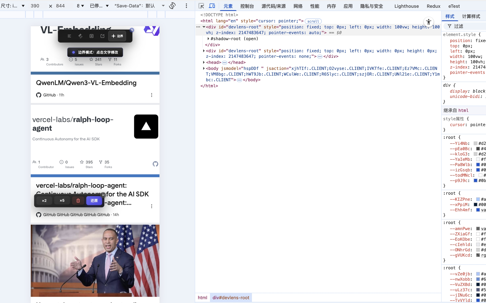
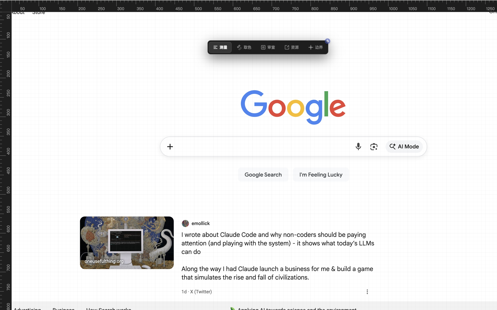
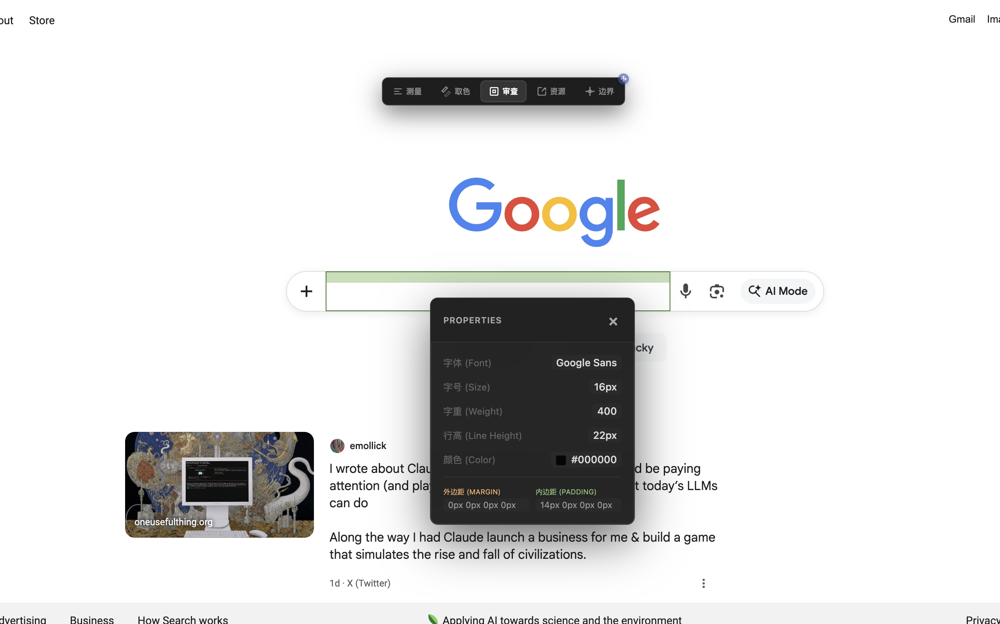
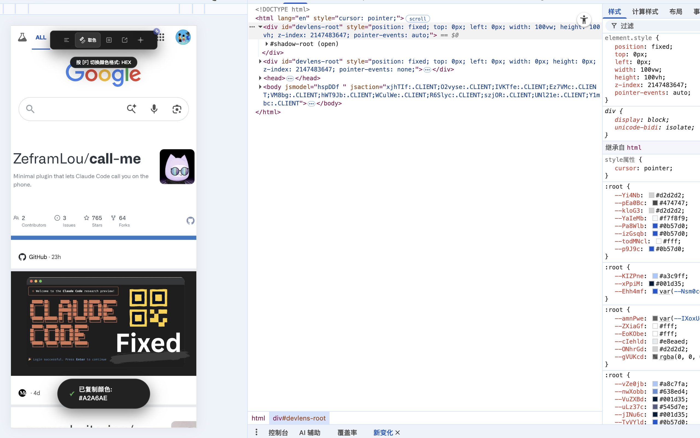
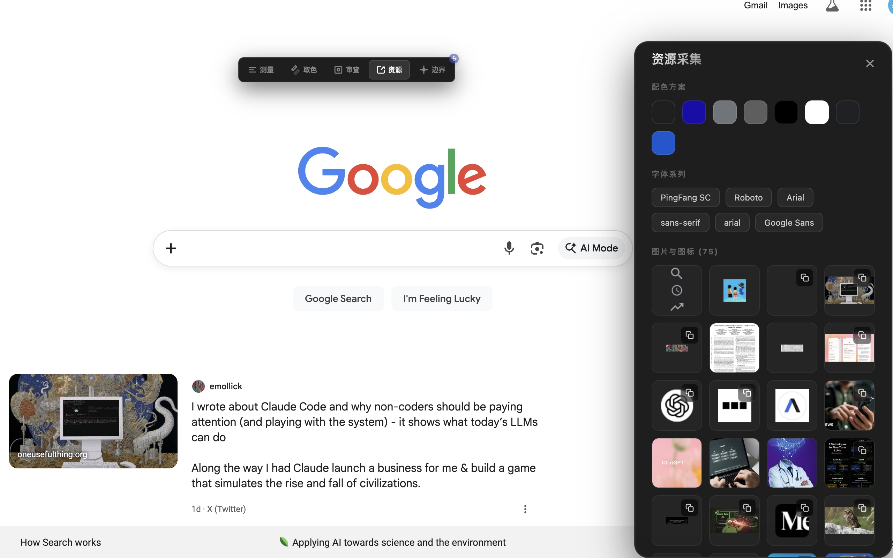

# ChiSu (尺素)

> 专业级开发者像素助手，精准测量与调试利器

  

## 📖 简介

ChiSu (尺素) 是一款为前端开发者和设计师量身定制的沉浸式 Chrome 扩展工具。它集成了高精度像素测量、实时颜色提取和深度的盒子模型审查功能，旨在提升日常 UI/UX 开发效率。通过无损的 Shadow DOM 技术注入，确保在任何复杂网页上都能稳定运行，且不产生样式冲突。

## ✨ 核心功能

### 📏 测量模式 (快捷键 `1`)

- **像素刻度尺** - 在页面顶部和左侧显示精准的像素刻度（移动端自适应）
- **多重标线** - 从刻度尺向内拖动即可生成无限量的水平或垂直参考线
- **距离自动测量** - 多条标线之间会自动显示像素距离，标签具备"智能边界避让"功能，确保在屏幕边缘也清晰可见
- **持久化与重拖拽** - 标线放置后可再次选中并重新调整位置，拖回刻度尺区域即可删除

### 🎨 取色模式 (快捷键 `2`)

- **实时放大镜** - 10 倍放大效果，带精准十字准星，确保像素级取色
- **移动端交互优化** - 支持"长按取色"——按下锁定滚动并开启放大镜，滑动选择，松开即自动复制并恢复滚动
- **感知式快照** - 滚动页面后自动更新屏幕快照，确保取色内容与视觉实时同步
- **多格式支持** - 按下 `F` 键可在 HEX、RGB 和 HSL 格式间自由切换

### 🔍 审查模式 (快捷键 `3`)

- **盒子模型可视化** - 鼠标悬停时自动显示元素的 Margin（橙色）和 Padding（绿色）区域
- **详尽属性卡片** - 点击元素即可锁定信息卡片（移动端为精致浮层），查看字体、字号、字重、行高、颜色及详尽的盒子间距
- **全属性复制** - 卡片内所有属性值及盒子模型间距均支持一键点击复制

### 📦 资源采集 (快捷键 `4`)

- **一键扫描** - 自动提取当前页面的配色方案、字体系列以及所有的图片与图标
- **可视化清单** - 以精致卡片形式分类展示，支持色彩一键复制，图片链接快速获取

### 🎯 边界模式 (快捷键 `5`)

- **"所见即所得"测试** - 点击页面任何文字即可直接进入编辑状态，快速测试极端字数下的布局表现
- **内容压力工具** - 内置"内容翻倍"、"暴力填充"和"快速清空"工具栏，支持局部一键还原

## 📸 功能预览

### 测量模式

精准的像素刻度尺和参考线，支持多维度测量。

### 取色模式

10倍实时放大镜，像素级精确取色，支持多种颜色格式。

### 审查模式

盒子模型可视化，实时显示元素的 Margin 和 Padding 区域。

### 资源采集

自动提取页面配色、字体和图片资源，一键复制使用。

### 边界测试

直接编辑页面文字，测试极端情况下的布局表现。

## 📱 移动端适配

ChiSu 对移动端 H5 调试进行了深度优化：

- **触摸优先** - 所有模块均支持单指触摸操作
- **灵动菜单** - 模式切换器采用顶部悬浮设计，支持自由拖拽，不遮挡关键内容
- **响应式布局** - 资源面板与审查卡片针对小屏幕重新设计，提供更佳的视觉体验

## ⌨️ 快捷键指南

| 快捷键 | 功能说明 |
|--------|---------|
| **Esc** | 开启 / 关闭 ChiSu 沉浸模式 |
| **1** | 切换至 **测量模式** |
| **2** | 切换至 **取色模式** |
| **3** | 切换至 **审查模式** |
| **4** | 切换至 **资源采集** |
| **5** | 切换至 **边界模式** |
| **F** | (取色模式下) 切换颜色格式 (HEX/RGB/HSL) |

## 🔗 相关链接

- 🌐 **Chrome Web Store**: [立即安装](https://chromewebstore.google.com/detail/bhmkgmnhfenlcgkoiockecndnmgclcke?utm_source=item-share-cb)
- 🌐 **GitHub releases**: [立即安装](https://github.com/xflihaibo/ChiSu/releases)
- 💻 **GitHub**: [查看源码](https://github.com/xflihaibo/ChiSu)

## 📝 版本信息

- **当前版本**: v1.0.1
- **更新日期**: 2026年
- **分类**: 开发者工具
- **语言支持**: 中文

## 🛠️ 技术特点

- **Shadow DOM 隔离** - 实现插件 UI 与原网页样式的完全隔离，防止样式冲突
- **Canvas API 渲染** - 高性能的刻度尺渲染、网格绘制及盒子模型高亮
- **Chrome Extension V3** - 利用 `captureVisibleTab` 实现高精度的像素采样

---

  <a href="qianmian-shuqian.md" style="color: #42b983; text-decoration: none;">← 上一个: 千面书签</a>
  <a href="banying.md" style="color: #42b983; text-decoration: none;">下一个: 伴影 →</a>

