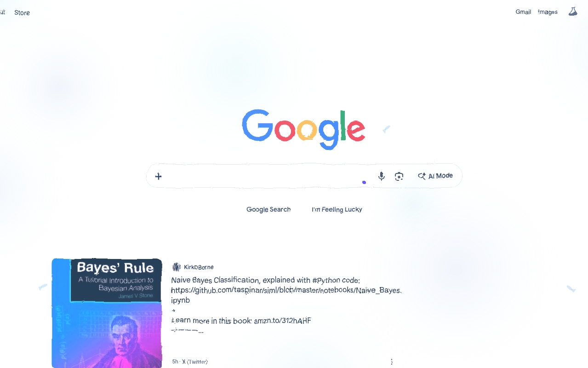
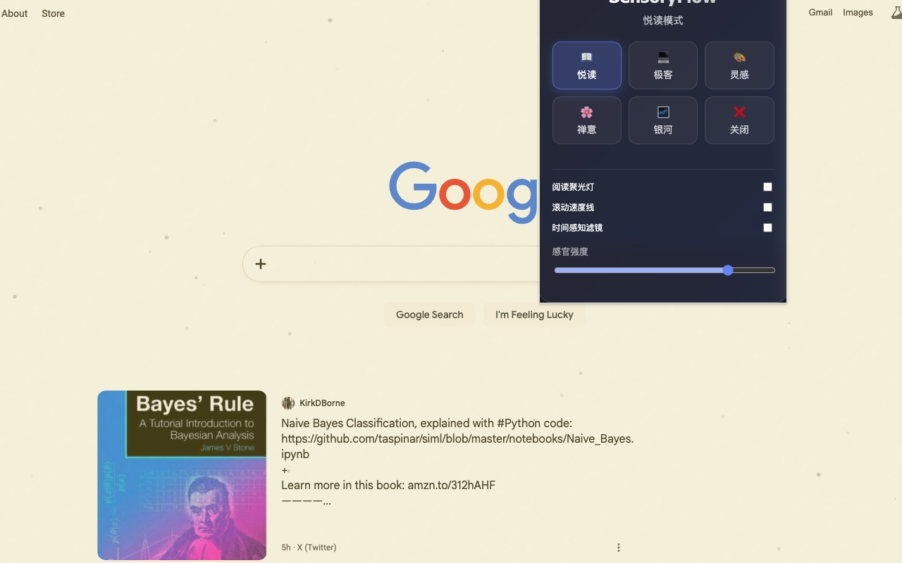
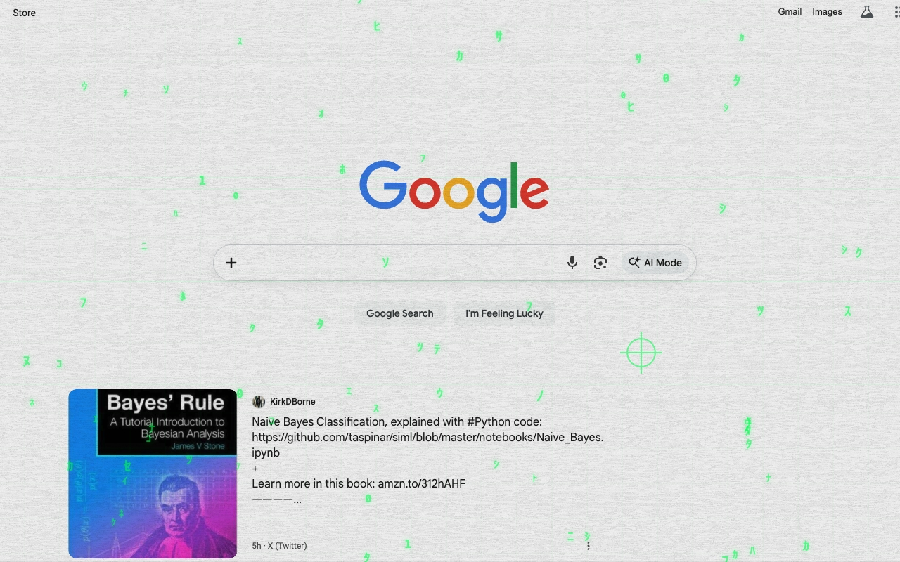
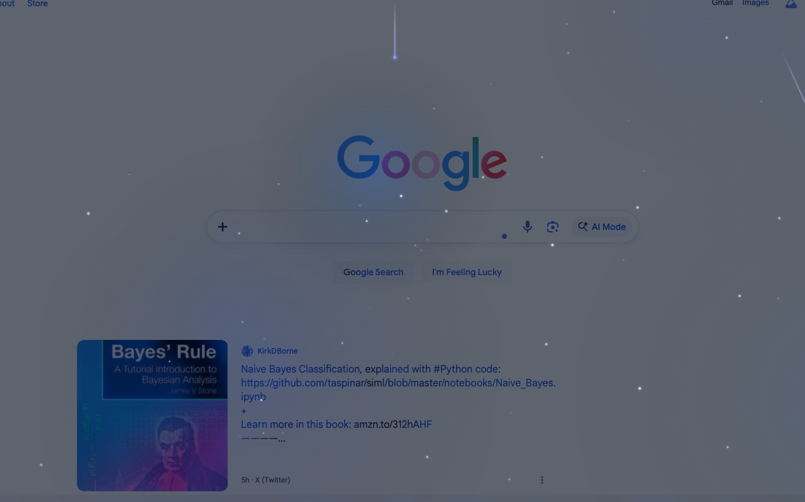

# SensoryFlow (感官流)

> 为您的网页注入灵魂。根据场景适配视觉滤镜与动态特效，重塑数字阅读与工作感官。

  

## 📖 简介

SensoryFlow (感官流) 是一款打破传统浏览体验的视觉增强工具。它能像"视觉实验室"一样，根据当前网页的情绪（内容、类型）自动适配氛围滤镜和物理交互特效，将枯燥的网页浏览转化为一场沉浸式的数字感官之旅。它将网页从死板的像素堆砌转化为一场沉浸式的感官之旅。

## ✨ 主要功能

### 核心模式

- 📖 **悦读模式 (Reading)** - 博客、新闻、文档场景，柔和纸质纹理、低对比度暖色调，文字引力磁吸、段落划过光晕
- 💻 **极客模式 (Coding)** - GitHub、技术论坛场景，故障风 (Glitch)、文字色差偏移，点击粒子喷溅、滚动动态模糊
- 🎨 **灵感模式 (Creative)** - 设计门户、图库场景，动态噪点、流动渐变、玻璃拟态，水波纹效果、图片重力感应
- 🧘 **禅意模式** - 落花与宁静，在嘈杂的互联网中寻找一片净土
- 🌌 **银河模式** - 在繁星与流星间穿梭，感受宇宙的宏大

### 进阶功能

- 🔦 **专注聚光灯** - 通过沉浸式光晕引导您的阅读注意力
- ⚡ **滚动速度线** - 为网页滚动赋予电影般的动感
- ⚙️ **智能性能保护** - 内置 FPS 监测，确保在任何设备上都能流畅运行
- 🎛️ **玻璃拟态控制面板** - 极致玻璃拟态面板，中心设有动态状态球（The Core），实时反映当前感官模式
- 🔒 **隐私保护** - 所有处理均在本地浏览器中完成，不收集任何个人数据

## 📸 功能预览

### 主界面

清晰直观的主界面设计，展示当前激活的感官模式和视觉特效。

### 极客模式

为技术站点注入赛博朋克能量，故障风效果和粒子特效让代码浏览更有趣。

### 灵感模式

将设计门户化作清澈的水池，伴有游鱼与涟漪，动态噪点和流动渐变带来创意灵感。

### 悦读模式

让长文阅读回归纸质质感，柔和纹理和暖色调守护视力，专注内容阅读体验。

## 🛠️ 技术特点

- **智能识别引擎** - 通过关键词权重算法自动识别网页类型，智能匹配对应模式
- **Shadow DOM 隔离** - 所有视觉覆盖层均注入在 Shadow DOM 中，确保不污染原始页面
- **SVG 滤镜池** - 预设多种高度优化的滤镜，实现波纹、故障感等特效
- **Offscreen Canvas** - 复杂粒子特效在离屏画布渲染，保证 60FPS 流畅体验
- **性能优化** - 按需渲染、降级机制、GPU 加速，确保低端设备也能流畅运行

## 🔗 相关链接

- 🌐 **Chrome Web Store**: [立即安装](https://chromewebstore.google.com/detail/nodebpefgkighabihegpgihodmjlldmd?utm_source=item-share-cb)
- 💻 **GitHub**: [查看源码](https://github.com/xflihaibo/sensoryflow)

## 📝 版本信息

- **当前版本**: v1.0.0
- **更新日期**: 2026年
- **分类**: 生产力工具 / 无障碍
- **语言支持**: 中文
- **清单版本**: Manifest V3

---

  <a href="banying.md" style="color: #42b983; text-decoration: none;">← 上一个: 伴影</a>
  <a href="y2k-ifier.md" style="color: #42b983; text-decoration: none;">下一个: Y2K-ifier →</a>

