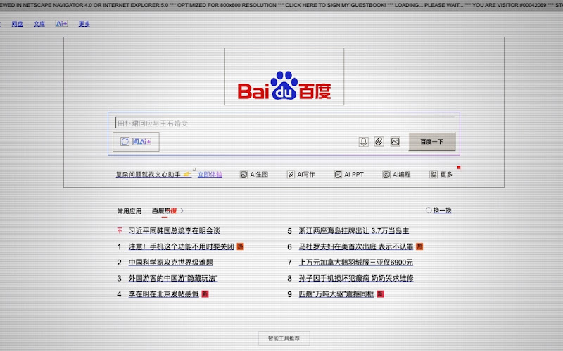

# Y2K-ifier 💾

> Welcome to the World Wide Web! 让现代互联网重回黄金时代。

  

## 📖 简介

**Y2K-ifier** 是一款遵循**单一用途 (Single Purpose)** 政策的 Google Chrome 扩展插件（Manifest V3），致力于提供纯粹的**网页视觉复古重塑体验**。它通过"手术级"的 CSS 注入技术，将现代网页的装饰性元素重构为 2000 年代初期的经典复古美学。让现代互联网重回黄金时代，提供沉浸式的怀旧浏览主题。

## ✨ 主要功能

### 核心视觉功能

- 🏛️ **"手术级"装饰重塑** - 将现代扁平化按钮和输入框还原为 Windows 98/2000 风格的灰色凹凸 3D 效果。系统级字体覆盖，让 Arial、MS Sans Serif 和 Times New Roman 重新定义阅读感。全局消除圆角，找回硬朗的直线条时代
- 📺 **硬件级显示模拟** - 细腻的水平扫描线叠加，配合 RGB 色差偏移，模拟老式显像管的显示质感。强制像素化渲染和低保真滤镜，重现早期互联网的图片质感
- 🕹️ **复古交互细节** - 系统级光标替换（白色粗边框箭头与复古"点击小手"）、怀旧功能挂件（"跑马灯"公告条与"正在建设中"像素挂件）、经典滚动条（Windows 2000 风格的灰色方块）

### 技术特点

- **单一用途合规** - 专注于网页视觉主题变换，不包含任何无关的功能捆绑
- **零数据收集** - 纯前端运行，没有任何网络请求发送至第三方服务器
- **权限最小化** - 仅申请必要的 `scripting` 和 `storage` 权限

## 📸 功能预览

### 复古界面展示

将现代网页转换为 Y2K 时代的经典美学，重现 2000 年代的网络视觉体验。

### 视觉效果对比

通过手术级的 CSS 注入技术，完美还原 Windows 98/2000 风格的界面元素和视觉效果。

## 🛠️ 技术特点

- **Manifest V3** - 遵循最新的 Chrome 扩展标准
- **动态样式注入** - 使用 `background.js` (Service Worker) 配合 `chrome.scripting` 实现动态样式与脚本注入
- **高优先级样式控制** - `retro.css` 结合 `all: initial` 隔离技术，确保对复杂站点的强力覆盖
- **像素级内联 SVG 动画** - 零外部资源依赖且 100% 还原动态效果

## 🔗 相关链接

- 🌐 **Chrome Web Store**: [立即安装](https://chromewebstore.google.com/detail/iamegjdjcfodbjajndfagnchgodppnnp?utm_source=item-share-cb)
- 💻 **GitHub**: [查看源码](https://github.com/xflihaibo/Y2K-ifier)

## 📝 版本信息

- **当前版本**: v1.0.0
- **更新日期**: 2026年
- **分类**: 风格工具 / 视觉增强
- **语言支持**: 中文
- **清单版本**: Manifest V3

---

  <a href="sensory-flow.md" style="color: #42b983; text-decoration: none;">← 上一个: SensoryFlow</a>
  <a href="README.md" style="color: #42b983; text-decoration: none;">返回首页 →</a>

